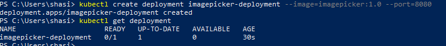
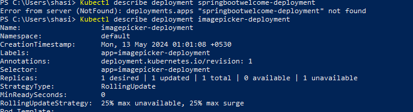

   

# Image Selection using Camunda + Spring Boot application.

## Project Description
1. Create a application that will help to select a type of animal from dropdown and after selection store the image into the database.
2. steps involved (to do list ):
   1. Download and Install Java and Intellij IDE.
   2. Get the Spring initializer project. 
   3. H2 or Mysql Database Setup. 
   4. create a Model class. 
   5. create a repository. 
   6. create a service class. 
   7. create a controller class. 
   8. create required CRUD operation methods. 
      1. Fetches the picture from an API.
      2. Stores the picture in a DB of your choice.
   9. Add Automated testcase.
   10. Containerize your application.
   11. Add a setup to make the app run locally on every machine.
   12. Add README provide with all documentation. 
   13. Add docker file.
   14. Add and build build our project into Kubernetes cluster.
   14. End

**Data Flow Diagram**

**Form Design**

**Application login**

Default Credential : username: demo, password : demo

#### Install of Docker and Kubernate on windows
- download Desktop Installer.exe and then follow link
  https://docs.docker.com/desktop/install/windows-install/
- once installation is complete then setting --> Kubernates --> Enable Kubernate checkbox --> Apply and restart
**Docker Run command** 
   - docker build -t imagepicker:1.0 .

**Logs**:

[INFO] Installing E:\Camunda_workspace\projects\ImagePicker\pom.xml to C:\Users\shasi\.m2\repository\com\example\workflow\ImagePicker\1.0.0-SNAPSHOT\ImagePicker-1.0.0-SNAPSHOT.pom
[INFO] ------------------------------------------------------------------------
[INFO] BUILD SUCCESS
[INFO] ------------------------------------------------------------------------
[INFO] Total time:  33.013 s
[INFO] Finished at: 2024-05-13T00:02:04+05:30
[INFO] ------------------------------------------------------------------------

#### **Deploy application on Kubernate**
similarly install minikube on windows and once installtion is complete, we want docker to be executed inside minicube.
- minikube
- Kubectl
  below command is to run the docker image inside Kubernetes.
- minikube start --driver=docker
  Next create Kubernetes service object and deployment object so that we can access it from outer world.
  here we are providing the deployment obj name and the port NO
- kubectl create deployment imagepicker-deployment --image=imagepicker:1.0 --port=8080
- kubectl get deployment
- 
- Describe more on the project
- 