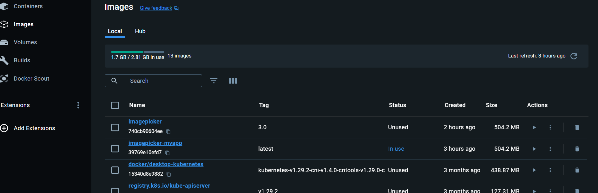
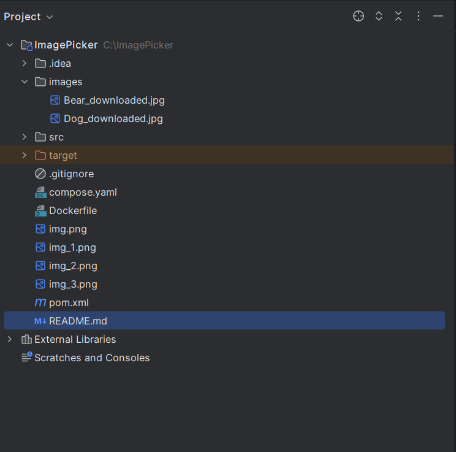

   

## Image Selection using Camunda + Spring Boot application.

### Project Description
1. Create an application that will help to select a type of animal from dropdown and after selection store the image into the database.
2. steps involved (to do list ):
   1. Download and Install Java and Intellij IDE. | Completed
   2. Get the Spring initializer project. | Completed 
   3. H2 or Mysql Database Setup. | Completed 
   4. create a Model class. | Not required 
   5. create a repository. | Completed 
   6. create a service class. | Completed 
   7. create a controller class. | Completed 
   8. create required CRUD operation methods. 
      1. Fetches the picture from an API. | Completed
      2. Stores the picture in a DB of your choice. | Completed (Storing on local file system)
      3. Fetch and show image back in HTML using tagging. | Pending
   9. Add Automated testcase.
   10. Containerize your application. | Completed
   11. Add a setup to make the app run locally on every machine.
   12. Add README provide with all documentation. | Completed 
   13. Add docker file. | Completed
   14. Add and build our project into Kubernetes cluster. | Completed

**Data Flow Diagram**

**Form Design**

**Application login**

Default Credential : 
   - username: demo 
   - password : demo

#### Install of Docker and Kubernate on windows

- download Desktop Installer.exe and then follow link
  https://docs.docker.com/desktop/install/windows-install/
  - once installation is complete then setting --> Kubernates --> Enable Kubernate checkbox --> Apply and restart

**Docker Run command** 

      docker build -t imagepicker:1.0 .

Docker Image named "imagepicker" uploaded on Docker App 

#### **Deploy application on Kubernate**
similarly **install minikube on windows** and once installation is complete, we want docker to be executed inside minicube.

    New-Item -Path 'c:\' -Name 'minikube' -ItemType Directory -Force
    Invoke-WebRequest -OutFile 'c:\minikube\minikube.exe' -Uri 'https://github.com/kubernetes/minikube/releases/latest/download/minikube-windows-amd64.exe' -UseBasicParsing

Add minikube.exe binary to your PATH

    $oldPath = [Environment]::GetEnvironmentVariable('Path', [EnvironmentVariableTarget]::Machine)
    if ($oldPath.Split(';') -inotcontains 'C:\minikube'){
    [Environment]::SetEnvironmentVariable('Path', $('{0};C:\minikube' -f $oldPath), [EnvironmentVariableTarget]::Machine)
    }

**minikube start** :- To start minikube

**minikube dashboard** To check deployment details

    http://127.0.0.1:61873/api/v1/namespaces/kubernetes-dashboard/services/

Below command is to run the docker image inside Kubernetes. (power shell)
 
    minikube start --driver=docker
  
Next create Kubernetes service object and deployment with port no 
     
    kubectl create deployment imagepicker-deployment1 --image=imagepicker:1.0 --port=8080
Check all deployments running

    kubectl get deployment
Describe Deployment details

    kubectl describe deployment imagepicker-deployment1

Step to create Docker steps are 

      docker build -t imagepicker:3.0 .
      docker-compose up

=============================================================================
Some of useful commands for cleanup operation

- Delete a deployment in Kubernetes
- kubectl delete deployment imagepicker-deployment4
- kubectl delete deployment --all --all-namespaces=true

=============================================================================

- 

- Structure of files and resource file structure in the real project

