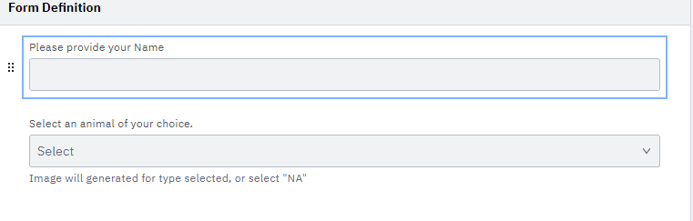

   

# Image Selection using Camunda + Spring Boot application.

## Project Description
1. Create a application that will help to select a type of animal from dropdown and after selection store the image into the database.
2. steps involved (to do list ):
   1. Download and Install Java and Intellij IDE.
   2. Get the Spring initializer project. 
   3. H2 or Mysql Database Setup. 
   4. create a Model class. 
   5. create a repository. 
   6. create a service class. 
   7. create a controller class. 
   8. create required CRUD operation methods. 
      1. Fetches the picture from an API.
      2. Stores the picture in a DB of your choice.
   9. Add Automated testcase.
   10. Containerize your application.
   11. Add a setup to make the app run locally on every machine.
   12. Add README provide with all documentation. 
   13. Add docker file.
   14. End

**Data Flow Diagram**

**form Design**

